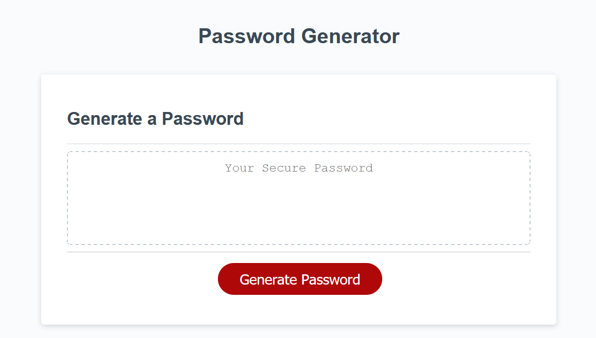

:part_alternation_mark:

# **Password Generator ScriptWork**
---
 

## Job Requirements
---

 

>Create a script that generates a password

>Password must meet requirmens specified by the user
  
 

| Job Requirements                               | Solutions                                                                                       |
| ---------------------------------------------- | ----------------------------------------------------------------------------------------------- |
| WHEN I click the button to generate a password                   | THEN I am presented with a series of prompts for password criteria   :heavy_check_mark:                                                          |
| WHEN prompted for password criteria | THEN I select which criteria to include in the password:heavy_check_mark: |
| WHEN prompted for the length of the password                 | THEN I choose a length of at least 8 characters and no more than 128 characters:heavy_check_mark:                                                           |
| WHEN prompted for character types to include in the password             | THEN I choose lowercase, uppercase, numeric, and/or special characters:heavy_check_mark:                                                              |
| WHEN I answer each prompt                  | THEN my input should be validated and at least one character type should be selected:heavy_check_mark:                                                        |
| WHEN all prompts are answered             | THEN a password is generated that matches the selected criteria:heavy_check_mark:                                                              |
| WHEN the password is generated                 | THEN the password is either displayed in an alert or written to the page:heavy_check_mark:                                                        |

 
 

## Credits
---
:school: 
**University of Toronto Continuing Educationg
Full Stack Flex Program** - *Initial HTML and CSS*
:school:

:heart: 
*Students and Instructors At the UFT-FSF-2020-2021*
:heart:

:scroll:
*Fisher-Yates ---Shuffle Function*
:scroll:
 

## License
---

All rights reserved.

Licensed under the MIT license.
 

 

:lock::lock::lock::lock:

_____
____
___
